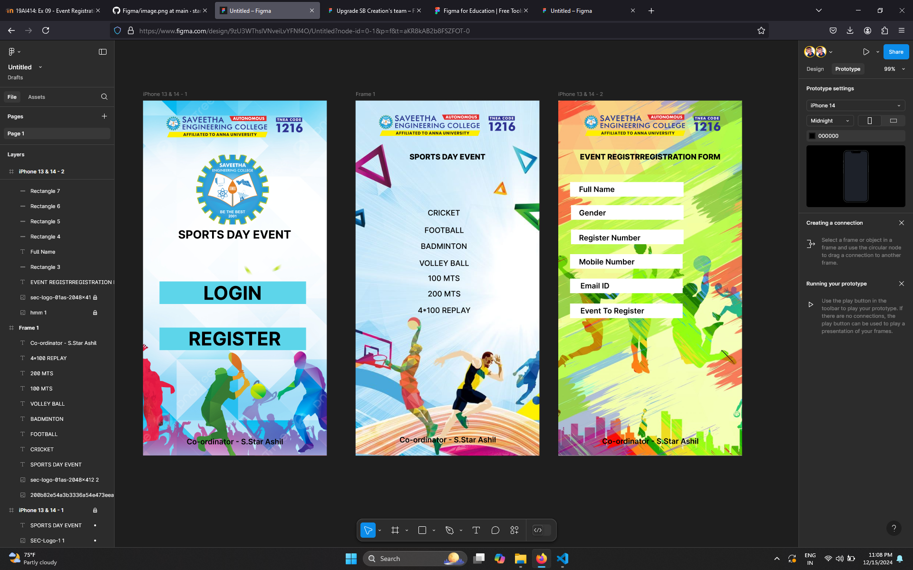

# Ex09 Event Registration Web Application
## Date:15-12-2024

## AIM:
To design, develop and deploy a web application for event registration.

## DESIGN STEPS:

### Step 1:
Create a new frame.

### Step 2:
Select any one preset size of your choice.

### Step 3:
Select the shapes you need.

### Step 4:
Import images as needed.

### Step 5:
Create pages based on your need and link them.

### Step 6:

Validate the HTML and CSS code.

### Step 6:

Publish the website in the given URL.

## DESIGN TOOL:
Figma

## CODE:
```
Home Page

<div style="width: 100%; height: 100%; position: relative; background: #B0EC5D">
    
    
    <div style="width: 311px; height: 48px; left: 35px; top: 482px; position: absolute; background: #5ED5EA"></div>
    <div style="width: 249px; height: 25px; left: 70px; top: 517px; position: absolute; text-align: center; color: black; font-size: 40px; font-family: Inter; font-weight: 700; word-wrap: break-word">REGISTER<br/></div>
    <div style="width: 311px; height: 48px; left: 35px; top: 384px; position: absolute; background: #5ED5EA"></div>
    <div style="width: 226px; height: 31px; left: 77px; top: 393px; position: absolute; text-align: center; color: black; font-size: 40px; font-family: Inter; font-weight: 700; word-wrap: break-word">LOGIN</div>
    
    <div style="width: 275px; height: 18px; left: 57px; top: 275px; position: absolute; text-align: center; color: black; font-size: 24px; font-family: Inter; font-weight: 700; word-wrap: break-word">SPORTS DAY EVENT</div>
</div>


// REGISTER<br/>
color: black;
 font-size: 40px;
 font-family: Inter;
 font-weight: 700;
 word-wrap: break-word
---
// LOGIN
color: black;
 font-size: 40px;
 font-family: Inter;
 font-weight: 700;
 word-wrap: break-word
---
// SPORTS DAY EVENT
color: black;
 font-size: 24px;
 font-family: Inter;
 font-weight: 700;
 word-wrap: break-word


 Page 2

 <div style="width: 100%; height: 100%; position: relative; background: black">
    
    
    <div style="width: 276px; height: 18px; left: 57px; top: 110px; position: absolute; text-align: center; color: black; font-size: 16px; font-family: Inter; font-weight: 800; word-wrap: break-word">SPORTS DAY EVENT</div>
    <div style="width: 261px; height: 43px; left: 57px; top: 217px; position: absolute; text-align: center; color: black; font-size: 16px; font-family: Inter; font-weight: 500; word-wrap: break-word">CRICKET</div>
    <div style="width: 248px; height: 31px; left: 64px; top: 260px; position: absolute; text-align: center; color: black; font-size: 16px; font-family: Inter; font-weight: 500; word-wrap: break-word">FOOTBALL</div>
    <div style="width: 203px; height: 23px; left: 86px; top: 298px; position: absolute; text-align: center; color: black; font-size: 16px; font-family: Inter; font-weight: 500; word-wrap: break-word">BADMINTON</div>
    <div style="width: 142px; height: 35px; left: 117px; top: 328px; position: absolute; text-align: center; color: black; font-size: 16px; font-family: Inter; font-weight: 500; word-wrap: break-word">VOLLEY BALL</div>
    <div style="width: 165px; height: 51px; left: 105px; top: 352px; position: absolute; text-align: center; color: black; font-size: 16px; font-family: Inter; font-weight: 500; word-wrap: break-word">100 MTS</div>
    <div style="width: 98px; height: 55px; left: 139px; top: 383px; position: absolute; text-align: center; color: black; font-size: 16px; font-family: Inter; font-weight: 500; word-wrap: break-word">200 MTS</div>
    <div style="width: 166px; height: 60px; left: 105px; top: 415px; position: absolute; text-align: center; color: black; font-size: 16px; font-family: Inter; font-weight: 500; word-wrap: break-word">4*100 REPLAY</div>
    <div style="width: 227px; height: 27px; left: 82px; top: 707px; position: absolute; text-align: center; color: black; font-size: 16px; font-family: Inter; font-weight: 600; word-wrap: break-word">Co-ordinator - S.Star Ashil</div>
</div>


// SPORTS DAY EVENT
color: black;
 font-size: 16px;
 font-family: Inter;
 font-weight: 800;
 word-wrap: break-word
---
// CRICKET
color: black;
 font-size: 16px;
 font-family: Inter;
 font-weight: 500;
 word-wrap: break-word
---
// FOOTBALL
color: black;
 font-size: 16px;
 font-family: Inter;
 font-weight: 500;
 word-wrap: break-word
---
// BADMINTON
color: black;
 font-size: 16px;
 font-family: Inter;
 font-weight: 500;
 word-wrap: break-word
---
// VOLLEY BALL
color: black;
 font-size: 16px;
 font-family: Inter;
 font-weight: 500;
 word-wrap: break-word
---
// 100 MTS
color: black;
 font-size: 16px;
 font-family: Inter;
 font-weight: 500;
 word-wrap: break-word
---
// 200 MTS
color: black;
 font-size: 16px;
 font-family: Inter;
 font-weight: 500;
 word-wrap: break-word
---
// 4*100 REPLAY
color: black;
 font-size: 16px;
 font-family: Inter;
 font-weight: 500;
 word-wrap: break-word
---
// Co-ordinator - S.Star Ashil
color: black;
 font-size: 16px;
 font-family: Inter;
 font-weight: 600;
 word-wrap: break-word


 Page 3


 <div style="width: 100%; height: 100%; position: relative; background: white">
    
    
    <div style="width: 336px; height: 18px; left: 27px; top: 110px; position: absolute; text-align: center; color: black; font-size: 16px; font-family: Inter; font-weight: 800; word-wrap: break-word">EVENT REGISTRREGISTRATION FORM</div>
    <div style="width: 241px; height: 31px; left: 25px; top: 173px; position: absolute; background: white"></div>
    <div style="width: 205px; height: 26px; left: 44px; top: 175px; position: absolute; color: black; font-size: 16px; font-family: Inter; font-weight: 600; word-wrap: break-word">Full Name</div>
    <div style="width: 239px; height: 31px; left: 27px; top: 222px; position: absolute; background: white"></div>
    <div style="width: 239px; height: 31px; left: 27px; top: 274px; position: absolute; background: white"></div>
    <div style="width: 239px; height: 31px; left: 25px; top: 326px; position: absolute; background: white"></div>
    <div style="width: 239px; height: 31px; left: 25px; top: 378px; position: absolute; background: white"></div>
    <div style="width: 240px; height: 30px; left: 44px; top: 223px; position: absolute; color: black; font-size: 16px; font-family: Inter; font-weight: 600; word-wrap: break-word">Gender</div>
    <div style="width: 236px; height: 28px; left: 44px; top: 277px; position: absolute; color: black; font-size: 16px; font-family: Inter; font-weight: 600; word-wrap: break-word">Register Number</div>
    <div style="width: 236px; height: 32px; left: 44px; top: 326px; position: absolute; color: black; font-size: 16px; font-family: Inter; font-weight: 600; word-wrap: break-word">Mobile Number</div>
    <div style="width: 237px; height: 32px; left: 47px; top: 377px; position: absolute; color: black; font-size: 16px; font-family: Inter; font-weight: 600; word-wrap: break-word">Email ID</div>
    <div style="width: 239px; height: 31px; left: 25px; top: 431px; position: absolute; background: white"></div>
    <div style="width: 237px; height: 32px; left: 47px; top: 430px; position: absolute; color: black; font-size: 16px; font-family: Inter; font-weight: 600; word-wrap: break-word">Event To Register</div>
    <div style="width: 223px; height: 23px; left: 84px; top: 712px; position: absolute; text-align: center; color: black; font-size: 16px; font-family: Inter; font-weight: 600; word-wrap: break-word">Co-ordinator - S.Star Ashil</div>
</div>


// EVENT REGISTRREGISTRATION FORM
color: black;
 font-size: 16px;
 font-family: Inter;
 font-weight: 800;
 word-wrap: break-word
---
// Full Name
color: black;
 font-size: 16px;
 font-family: Inter;
 font-weight: 600;
 word-wrap: break-word
---
// Gender
color: black;
 font-size: 16px;
 font-family: Inter;
 font-weight: 600;
 word-wrap: break-word
---
// Register Number
color: black;
 font-size: 16px;
 font-family: Inter;
 font-weight: 600;
 word-wrap: break-word
---
// Mobile Number
color: black;
 font-size: 16px;
 font-family: Inter;
 font-weight: 600;
 word-wrap: break-word
---
// Email ID
color: black;
 font-size: 16px;
 font-family: Inter;
 font-weight: 600;
 word-wrap: break-word
---
// Event To Register
color: black;
 font-size: 16px;
 font-family: Inter;
 font-weight: 600;
 word-wrap: break-word
---
// Co-ordinator - S.Star Ashil
color: black;
 font-size: 16px;
 font-family: Inter;
 font-weight: 600;
 word-wrap: break-word


```

## OUTPUT:


## RESULT:
The program to design, develop and deploy a web application for event registration is completed successfully.
